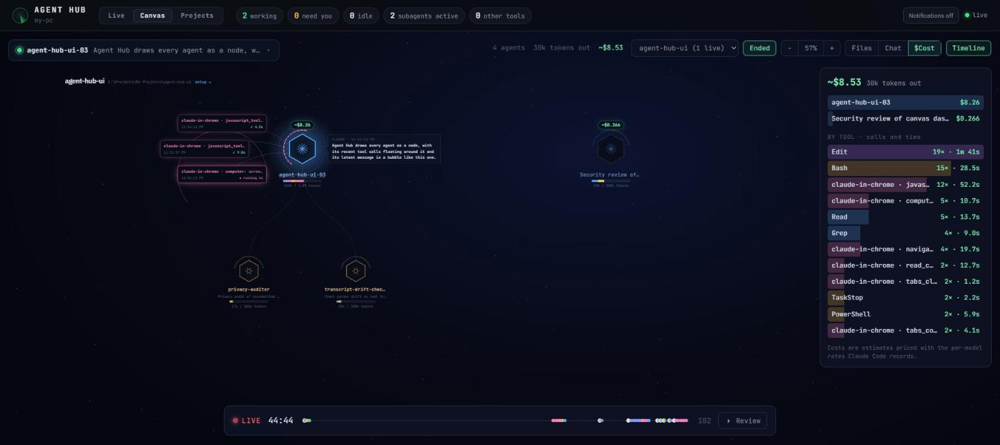

# Agent Hub

[](https://www.npmjs.com/package/agent-hub-ui)
[](https://github.com/UurDemir/agent-hub-ui/actions/workflows/ci.yml)
[](LICENSE)

A local web dashboard that shows every coding agent running on this PC and what each one is doing, live.



## Run it

No clone needed. With Node 20 or newer:

```
npx agent-hub-ui                      # from npm
npx github:UurDemir/agent-hub-ui      # or straight from GitHub
```

It starts on http://127.0.0.1:4317 and opens your browser. Stop it with Ctrl+C.

| Option | |
|---|---|
| `--port <port>` | Use another port (default 4317) |
| `--no-open` | Don't open the browser |
| `--host <host>` | Address to bind (default `127.0.0.1`; keep it local, transcripts contain your code) |

To keep it around, install it globally with `npm install -g agent-hub-ui` and run `agent-hub`.

From a clone, use `npm start` (or `npm run open` to also open the browser). There are no dependencies, so there's nothing to `npm install`.

## What it shows

- **Live activity**: one swimlane per agent and subagent. Each tool call is a bar colored by type (read, edit, shell, web, subagent, MCP…), sized by how long it took. Failed calls get a red marker. Your messages show as white lines and agent replies as dots. Hover a bar for details and click a lane to follow that agent. You can switch the window between 2 minutes and 2 hours.
- **Agent cards**: status (working / needs you / idle / ended), project and branch, what the agent is doing right now with a running timer, active subagents, model, context size, output tokens and tool count.
- **Detail panel**: the full timeline of prompts, replies and tool calls. Click a tool call to see its input and output. The panel also shows the agent's plan (TodoWrite), background-job tasks, subagents and PR links.
- **Canvas** (`#/canvas`): a live map of your agents as a node graph. Each agent is a hexagon with its estimated cost, context usage and a ring of its recent tool types; subagents hang off their parent with particles flowing while they work. Recent tool calls float around each agent (click one for its input and output) and Claude's latest message shows as a bubble. Ended sessions and finished subagents fade out about a minute and a half after their last activity, like finished tool calls (turn on **Ended** to keep them). Side panels show cost per agent and per tool, the selected agent's conversation, and the files being read and changed. The timeline at the bottom shows every event: click or drag it to see the map at an earlier moment, or press Review to replay. Pick a single project with the selector (`#/canvas/<project>`), drag to pan, scroll to zoom.
- **Other AI tools**: Cursor, Windsurf, Copilot CLI, Codex CLI, Gemini CLI, Aider, opencode, Goose, Claude Desktop, Ollama and LM Studio are detected from the process list. For these it shows presence, process count, memory and uptime.
- **Projects page** (`#/projects`): every folder you've used Claude Code in, plus your global `~/.claude` setup. Each project has tabs for:
  - CLAUDE.md files and rules
  - agents, skills and slash commands, each with a usage count taken from the project's transcripts
  - MCP servers, hooks and permissions
  - auto-memory and sessions
  - plugins (global setup only)

  Credentials in MCP commands, env vars and headers are hidden. The API only reads paths of projects Claude Code already knows about.
- **Notifications** (optional): a desktop notification when an agent finishes or needs your input while the tab is in the background.

## How it works

`server/` reads Claude Code's local state and streams it to the page over Server-Sent Events:

| Source | Used for |
|---|---|
| `~/.claude/sessions/<pid>.json` | which sessions are running, and whether each is busy or idle |
| `~/.claude/projects/<project>/<session>.jsonl` | the transcript, tailed incrementally |
| `…/<session>/subagents/agent-*.jsonl` | subagent transcripts and metadata |
| `~/.claude/jobs/<id>/state.json` | background-job state and its running shell tasks |

It reads only these files, never writes them, and never touches your credentials. The server listens on `127.0.0.1` only, because transcripts contain your code and prompts. Set `PORT` to change the port. Set `CLAUDE_CONFIG_DIR` if your Claude config lives somewhere else.

To add another agent that keeps local logs, write a collector like `server/claude.js` that emits the same event shape (`prompt`, `say`, `tool`, `result`).

## Acknowledgements

The Canvas view's design is based on [agent-flow](https://github.com/patoles/agent-flow) by Simon Patole ([@patoles](https://github.com/patoles)).

## License

[MIT](LICENSE) © Uğur Demir
